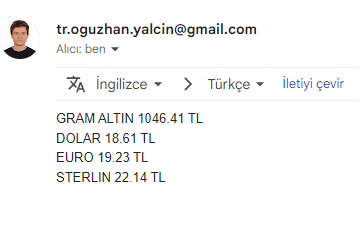

## Python Döviz Kuru Uygulaması

Uygulamayı Çalıştırdığımızda Sitedeki döviz kurlarını çekiyor ve bunları bize e-posta yoluyla gönderiyor.
- Döviz Kurlarını <strong>[Doviz.com](https://www.doviz.com/)</strong> sitesinden çektim.
- Site üzerinden verileri çekmek için <strong>requests</strong> kütüphanesini kullandım.
- Çektiğim verileri düzenlemek için <strong>BeautifulSoup</strong> kütüphanesini kullandım.
- Düzenlediğim verileri e-posta ile göndermek için <strong>smtplib</strong> kütüphanesini kullandım.
[Kaynak Kodu](https://github.com/oguzhan-developer/PythonProjects/blob/main/DovizKuru/main.py)

